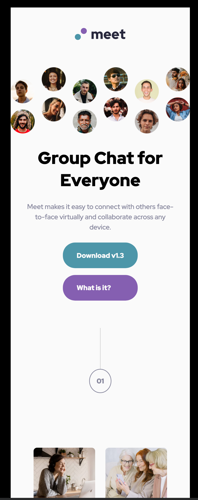
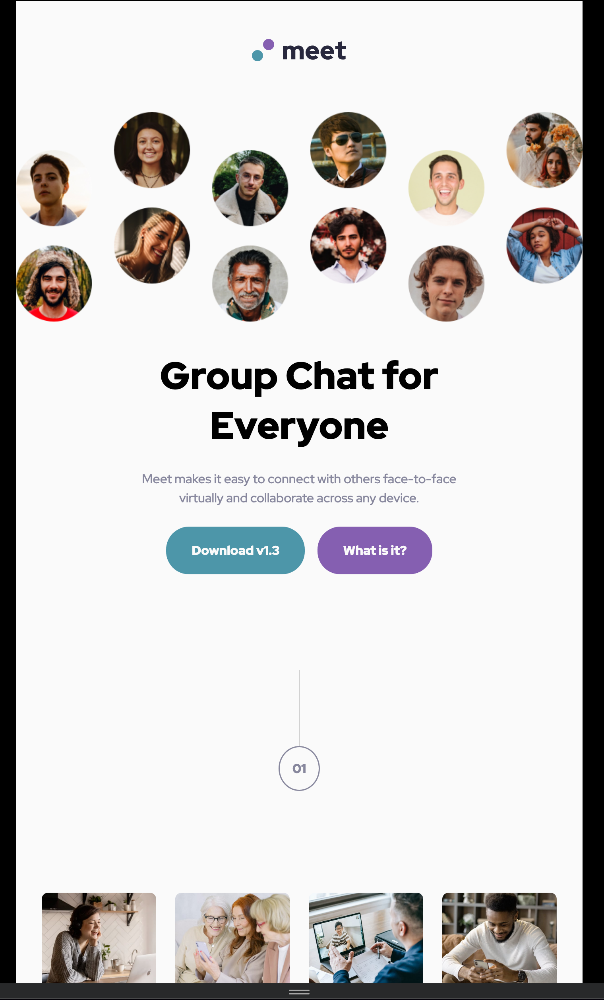
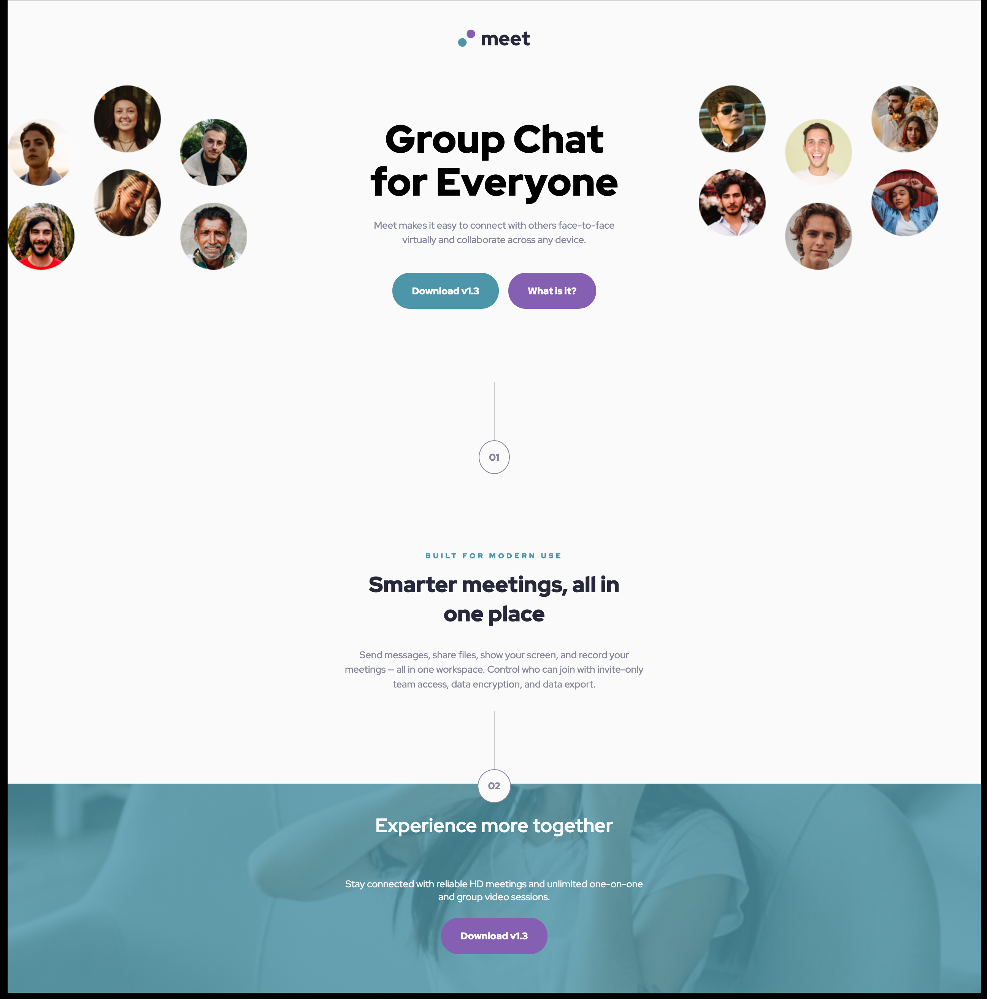

# Frontend Mentor - Meet landing page solution

This is a solution to the [Meet landing page challenge on Frontend Mentor](https://www.frontendmentor.io/challenges/meet-landing-page-rbTDS6OUR). Frontend Mentor challenges help you improve your coding skills by building realistic projects.

## Table of contents

- [Overview](#overview)
  - [The challenge](#the-challenge)
  - [Screenshot](#screenshot)
  - [Links](#links)
- [My process](#my-process)
  - [Built with](#built-with)
  - [What I learned](#what-i-learned)
  - [Continued development](#continued-development)
  - [Useful resources](#useful-resources)
- [Author](#author)
- [Acknowledgments](#acknowledgments)

## Overview

This is a small responsive single page site advertising a social network platform. The design came with mobile, tablet and desktop layout.

### The challenge

Users should be able to:

- View the optimal layout depending on their device's screen size
- See hover states for interactive elements

### Screenshot







### Links

- Solution URL: [Add solution URL here]()
- Live Site URL: [Netlify](https://fem-meet-landing-page-final.netlify.app/)

## My process

Was created mobile first, moved on to tablet and finally desktop. I used media queries to make it responsive.

### Built with

- Semantic HTML5 markup
- CSS custom properties
- Flexbox
- CSS Grid
- Mobile-first workflow

### What I learned

I learned the display: none function which was very handy for hiding elements on layouts.

```html
<picture class="responsive-image mobile-tablet-image">
  
</picture>
```

```css
  .mobile-tablet-image,
  .mobile-tablet-h1,
  .mobile-tablet-p {
    display: none;
```

### Continued development

One year away from coding! Here we go again thankfully.

### Useful resources

- [Every Layout by Andy Bell](https://every-layout.dev/) - This is my next read and will help with CSS layouts.
- [CSS Tricks](https://css-tricks.com/) - Excellent reference for CSS. Always refer to this!

## Author

- Website - [Find me on Up-work](https://www.upwork.com/freelancers/~018613765e268de80b?viewMode=1)
- Frontend Mentor - [@John-Davidson-8](https://www.frontendmentor.io/profile/John-Davidson-8)

## Acknowledgments

CSS Tricks and Kevin Powell, learn so much from them.
